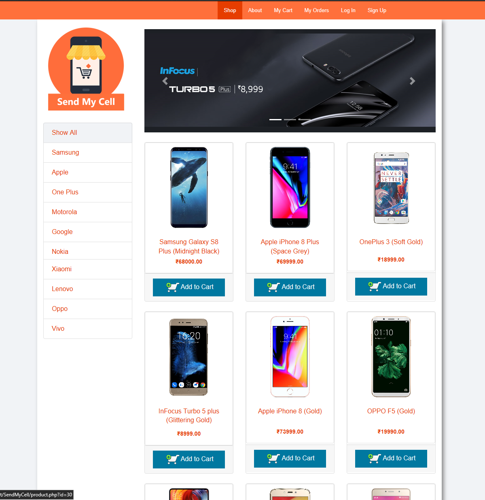
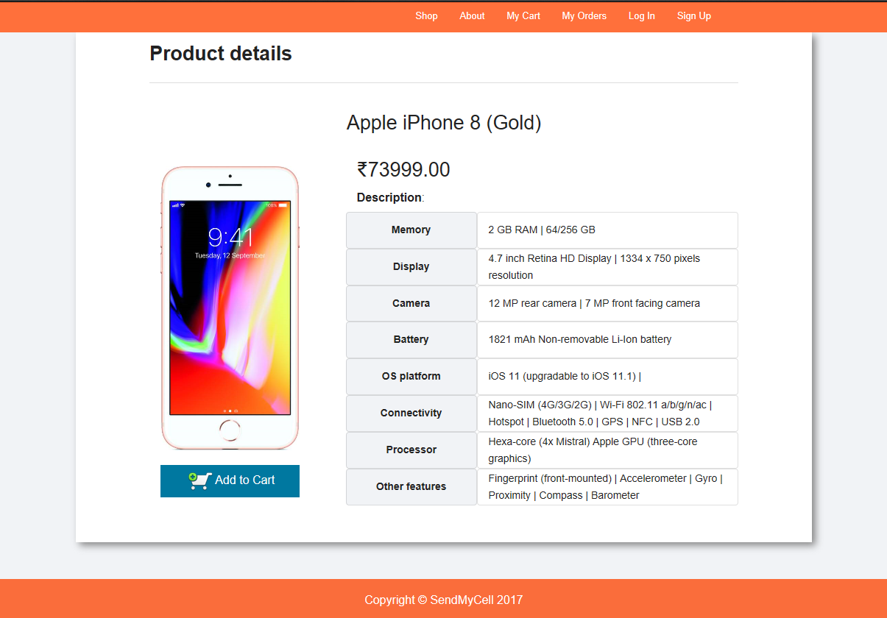
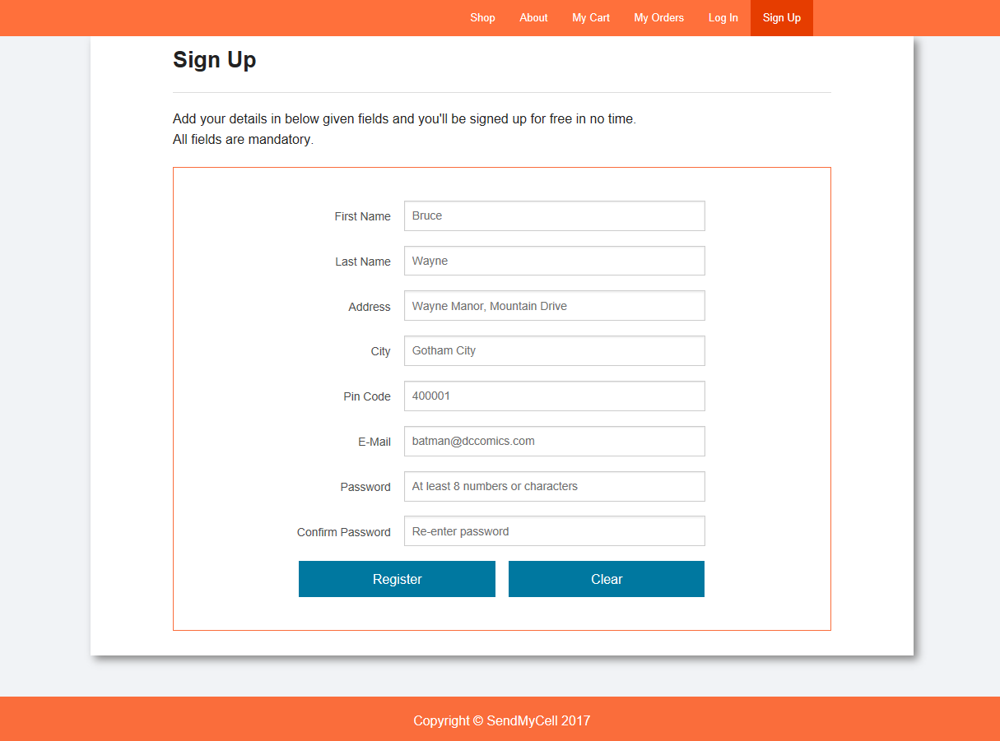

  # SendMyCell - PHP project
  
  
  
- SendMyCell is a project on E-Commerce Website & database designing. 
- SendMyCell is an online store for mobiles and accessories. 
- You can choose from thousands of mobiles and buy the perfect phone that matches your perfect personnality.

## To run & view this project
  1. Download Xampp & save it in C:
  2. Download & save these files in Xampp/htdocs/SendMyCell
  3. Start Apache & MySQL from Xampp Control Panel
  4. Visit link [http://localhost/phpmyadmin/](http://localhost/phpmyadmin/) from any browser 
  5. Import SendMyCell.sql
  6. Visit link [http://localhost/SendMyCell/index.php](http://localhost/SendMyCell/index.php]) from any browser 
  
## Some ScreenShots

### Main index page

### Product page

### Registeration page

